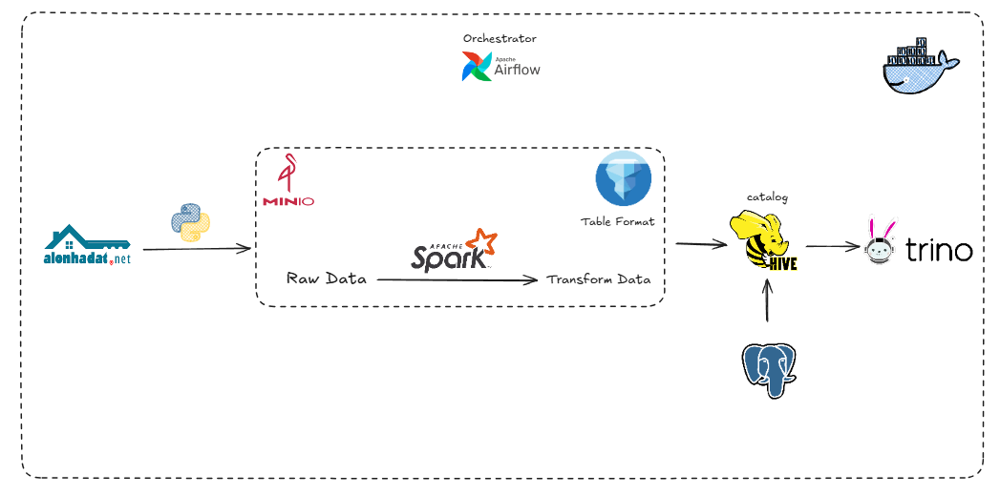

# Bat Dong San Data Platform

## Overview
This project assembles an end-to-end data pipeline that captures Hanoi real-estate listings, cleans them, and publishes curated datasets for analytics. Everything runs locally through Docker Compose, so you can reproduce the lakehouse stack (Airflow, Spark, MinIO, Hive, Trino) with a single command.

## High-Level Architecture

- **Orchestration**: Apache Airflow (Celery executor) schedules the crawl_daily DAG in dags/dag.py to crawl listings and trigger Spark processing.
- **Ingestion Layer**: ingest/crawler.py scrapes alonhadat.com.vn with Requests and BeautifulSoup, normalises the payload into a parquet file, and lands it in the MinIO raw bucket.
- **Processing Layer**: A Spark job defined in transform/transform.py and backed by helpers in transform/utils cleans, enriches, and deduplicates the data before merging with prior runs.
- **Storage Layer**: MinIO acts as the object store, while Hive Metastore plus Apache Iceberg manage table metadata and enable ACID updates inside the cleaned bucket.
- **Compute & Serving**: A Spark master/worker pair executes transformations, and Trino exposes the curated Iceberg tables for downstream SQL or BI tools.
- **User Analytics**: The Power BI report at dashboard/real-estate-dashboard.pbix consumes the cleaned dataset to visualise market signals for stakeholders.

## Key Features
- Daily, automated crawl-and-transform workflow orchestrated by Airflow.
- Robust parsing that converts Vietnamese price and area formats into numeric columns, with URL-based deduplication.
- Incremental merge logic (transform/utils/data_merger.py) that preserves historical records while appending new listings.
- Iceberg-backed storage with schema enforcement and replace semantics for consistent downstream reads.
- Fully containerised development environment defined in docker-compose.yml, including supporting services (Postgres, Redis, MinIO, Hive, Spark, Trino).

## Results
- Raw parquet snapshots for up to 99 listing pages captured per run and versioned in the MinIO raw bucket.
- Curated Iceberg table iceberg.default.example_table stored in the cleaned bucket, ready for SQL access via Trino or direct Spark reads.
- Sample analytics delivered through the bundled Power BI dashboard, highlighting price distribution by district, relationship between area and price, and inventory mix by property attributes.
- Console logging from the Spark job surfaces top-valued listings each day to sanity-check pipeline output before publishing.
